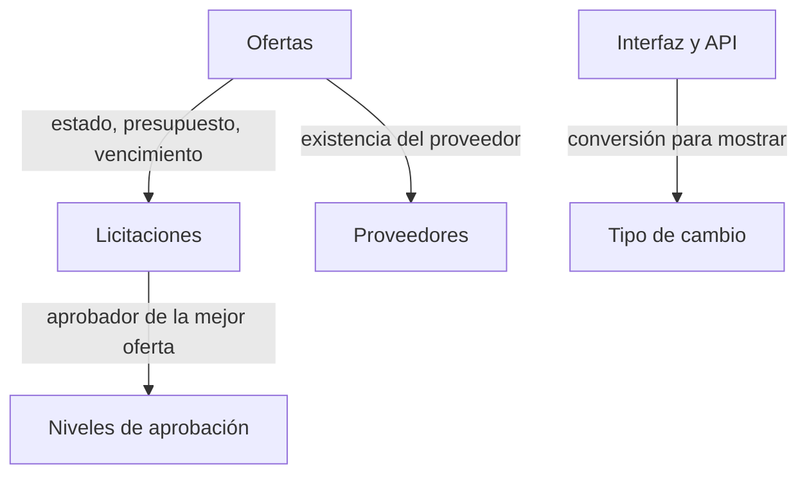

# Arquitectura general

Volver al [índice de la documentación](README.md).

## 1. Visión de capas y dirección de dependencias

```mermaid
flowchart LR
    Web[Licitaciones.Web<br/>MVC] --> App[Licitaciones.Application<br/>casos de uso]
    Api[Licitaciones.Api<br/>REST] --> App
    App --> Dom[Licitaciones.Domain<br/>reglas de negocio]
    Infra[Licitaciones.Infrastructure<br/>EF Core] --> App
    Infra --> Dom
    Infra --> PG[(PostgreSQL 16)]
    Web -.solo en Program.cs.-> Infra
    Api -.solo en Program.cs.-> Infra
```

`Domain` no referencia a ningún otro proyecto. `Application` referencia únicamente a
`Domain` y no conoce Entity Framework Core: **define** las interfaces de acceso a datos y
es `Infrastructure` quien las implementa. `Web` y `Api` referencian a `Application` y, solo
para el registro de dependencias en `Program.cs`, a `Infrastructure`.

La regla no depende de la disciplina de quien programa: `DireccionDependenciasTests`
comprueba por reflexión que el ensamblado de dominio no referencia Entity Framework Core,
Npgsql ni ASP.NET Core, y que tampoco referencia la capa de aplicación. Si alguien añade
una referencia indebida, la prueba falla.

## 2. Módulos

El sistema es un **monolito modular**. Cada módulo tiene su carpeta propia dentro de cada
capa y no accede al repositorio de otro: se comunica por servicios de aplicación.



Proveedores y Tipo de cambio no dependen de nadie. Ofertas es el módulo con más
dependencias porque es donde se cruzan las reglas. El detalle de quién es dueño de cada
regla está en [integracion-modulos.md](integracion-modulos.md).

## 3. Decisiones de arquitectura

### Monolito modular en lugar de microservicios

El enunciado admite ambos y no cambia la ponderación. Se eligió el monolito porque los
cinco módulos comparten una única base de datos y varias reglas cruzan sus fronteras —una
oferta necesita el presupuesto de su licitación en la misma transacción—. Repartirlos en
servicios obligaría a coordinar transacciones distribuidas para resolver un problema que
no existe: no hay equipos independientes ni necesidad de escalar una parte por separado.
Dividir aquí sería complejidad decorativa, justo lo contrario del diseño simple de XP.

### Web y API como dos procesos

Se despliegan como dos aplicaciones anfitrionas independientes, cada una con su imagen y su
servicio. Comparten `Application` e `Infrastructure` como bibliotecas. Alojar ambas en un
único proceso habría simplificado el despliegue, pero separarlas permite exponer solo la
API en un entorno donde la interfaz no haga falta, y hace que un fallo en una no tumbe la
otra.

### Objetos de transferencia en toda la frontera

Ninguna entidad de Entity Framework Core sale de `Application`. Los controladores reciben y
devuelven registros definidos en la capa de aplicación. Exponer las entidades ataría el
contrato público de la API al esquema de la base: cualquier cambio de columna se
convertiría en un cambio incompatible para quien la consume.

### Resultado tipado en lugar de excepciones

Los casos de uso devuelven `Result<T>` con un `ErrorAplicacion` que lleva código, mensaje y
tipo. El rechazo de una regla de negocio es una salida **esperada**, no una situación
excepcional: usar excepciones para expresarla convertiría el flujo normal en control por
excepción y haría más difícil saber, leyendo una firma, qué puede fallar.

`ControladorApiBase` traduce el tipo del error al código HTTP —404, 409 o 422— en un solo
punto, así que ningún controlador decide eso por su cuenta.

### Reloj inyectable

Ni `Domain` ni `Application` consultan la hora directamente: la reciben por `IClock`. Sin
esto, las reglas de vencimiento serían imposibles de probar de forma determinista —habría
que esperar a que pasara una fecha real— y los casos frontera exigidos, como registrar una
oferta en el instante exacto del cierre, no se podrían escribir.

`SystemClock` vive en `Infrastructure` y es la única clase autorizada a leer el reloj.

### Borrado lógico

Licitaciones y proveedores no se eliminan: se marcan con `DeletedAt` y un filtro global los
excluye de las consultas. Las ofertas que los referencian son evidencia del proceso y
quedarían huérfanas si la fila desapareciera. Las claves foráneas restrictivas impiden,
además, que alguien las borre físicamente por otra vía.

La oferta **no** tiene borrado lógico: o existe, o se elimina mientras su licitación siga
vigente. No hay ningún momento en que se quiera ocultarla sin borrarla.

### Concurrencia optimista sobre `xmin`

Se usa la columna de sistema que PostgreSQL ya mantiene en cada fila, en lugar de añadir y
mantener una columna de versión propia. Se declara como propiedad sombra para que el
dominio no tenga que conocerla.

### Objeto de valor para el dinero

`MontoCRC` encapsula las dos reglas que todo valor monetario cumple —mayor que cero, dos
decimales— y se mapea a `numeric(18,2)`. Concentrarlas en un tipo evita repetir la
validación en cada servicio y hace imposible construir un monto inválido.

## 4. Cómo se aplica el diseño simple

- No hay patrones especulativos: ni mediadores, ni separación de lectura y escritura, ni
  capas adicionales «por si acaso».
- Las únicas abstracciones con una sola implementación son los puertos de infraestructura y
  `IClock`, y existen porque sin ellas las pruebas necesitarían base de datos o reloj real.
- La estructura creció cuando una historia la necesitó: `Result<T>` apareció con el primer
  servicio de aplicación, no antes; el filtro de listados se generalizó cuando hubo más de
  un listado que paginar.
- Cada refactorización del historial responde a un problema concreto encontrado al
  implementar, no a una mejora imaginada. Están registradas en
  [bitacora-xp.md](bitacora-xp.md).

## 5. Estructura de la solución

```
src/
  Licitaciones.Domain/          entidades, objetos de valor, servicios de dominio, IClock
  Licitaciones.Application/     casos de uso, objetos de transferencia, puertos, Result
  Licitaciones.Infrastructure/  EF Core, repositorios, migraciones, SystemClock
  Licitaciones.Web/             controladores MVC y vistas Razor
  Licitaciones.Api/             controladores REST, OpenAPI, middleware de excepciones
tests/
  Licitaciones.UnitTests/         dominio y aplicación, sin base de datos
  Licitaciones.IntegrationTests/  PostgreSQL real en contenedor
  Licitaciones.FunctionalTests/   navegador real con Playwright
```
