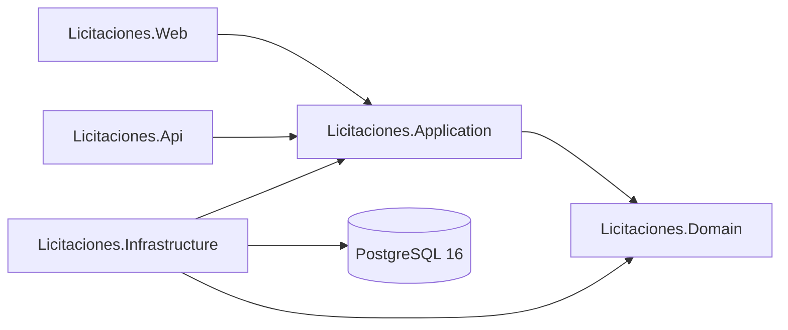

# Arquitectura general

> Estado: **pendiente**. Se completa en la entrega 3 (dominio) y se cierra en la entrega 15.
> Referencia de navegación: [README.md](README.md).

## 1. Visión de capas y dirección de dependencias

`Domain` no referencia a ningún otro proyecto. `Application` referencia únicamente a
`Domain` y no conoce Entity Framework Core. `Web` y `Api` referencian a `Application`
y, solo para el registro de dependencias, a `Infrastructure`.

## 2. Decisiones de arquitectura

Pendiente de desarrollo. Se justificarán al menos: monolito modular, borrado lógico,
abstracción del reloj mediante `IClock`, estrategia de concurrencia optimista y
alojamiento de Web y API en un único host.

## 3. Diseño simple

Pendiente de desarrollo.
