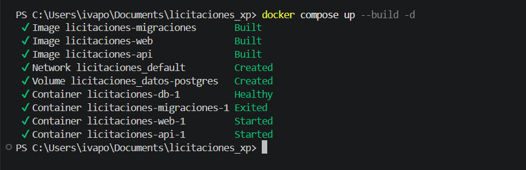
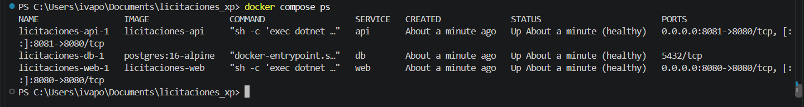
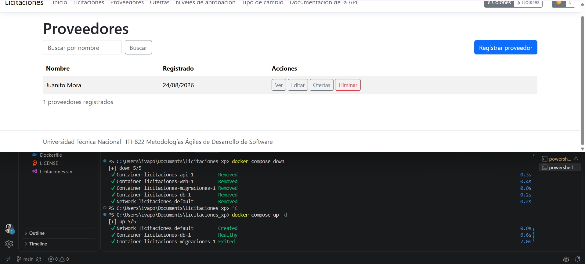

# Docker y Docker Compose

Volver al [índice de la documentación](README.md).

El sistema completo se levanta con un solo comando. No hace falta instalar .NET,
PostgreSQL ni ninguna otra cosa en la máquina: basta con Docker.

## 1. Requisitos previos

| Requisito | Versión mínima |
|---|---|
| Docker Engine | 24 |
| Docker Compose | v2 (integrado en el comando `docker compose`) |

No se necesita el SDK de .NET: la compilación ocurre dentro de la imagen.

## 2. Variables de entorno

Las credenciales **no están en el repositorio**. Se toman de un archivo `.env` que no se
versiona, creado a partir de la plantilla:

```bash
cp .env.example .env
```

| Variable | Para qué sirve |
|---|---|
| `POSTGRES_USER` | Usuario con el que la aplicación se conecta a PostgreSQL. |
| `POSTGRES_PASSWORD` | Su contraseña. |

Si alguna falta, Compose se detiene con un mensaje que la nombra en lugar de arrancar con
un valor vacío. Es deliberado: una base sin contraseña arrancaría igual y el problema se
descubriría mucho más tarde.

El nombre de la base, el anfitrión y el puerto no son secretos y viven en `compose.yaml`.

## 3. Comandos de arranque

```bash
cp .env.example .env          # una sola vez, y editar los valores
docker compose up --build     # levanta todo
```

Cuando termina:

| Servicio | Dirección |
|---|---|
| Aplicación web | http://localhost:8080 |
| API | http://localhost:8081 |
| Documentación interactiva | http://localhost:8081/swagger |



Con `docker compose ps` se comprueba que los tres servicios quedaron en buen estado. El de
migraciones aparece como terminado, que es lo correcto: hace su trabajo y sale.



Otros comandos útiles:

```bash
docker compose ps                      # estado y salud de cada servicio
docker compose logs -f web             # registro de la aplicación web
docker compose logs migraciones        # qué migraciones se aplicaron
docker compose down                    # detener, conservando los datos
docker compose down -v                 # detener y BORRAR los datos
```

## 4. Verificación de las comprobaciones de salud

Los tres servicios de larga vida declaran su estado de salud, y Compose lo muestra:

```bash
$ docker compose ps --format 'table {{.Service}}\t{{.Status}}'
SERVICE   STATUS
api       Up 41 seconds (healthy)
db        Up 51 seconds (healthy)
web       Up 41 seconds (healthy)
```

- **`db`** usa `pg_isready`.
- **`web`** y **`api`** consultan `/health/ready`, que además de responder comprueba que
  alcanzan la base.

También se pueden consultar a mano:

```bash
curl -s -o /dev/null -w '%{http_code}\n' http://localhost:8080/health/ready   # 200
curl -s -o /dev/null -w '%{http_code}\n' http://localhost:8081/health/ready   # 200
```

### El orden de arranque no se deja al azar

`web` y `api` no arrancan hasta que **la base está sana** y **las migraciones terminaron
bien**. Compose lo expresa con `condition: service_healthy` y
`condition: service_completed_successfully`. Sin eso, la aplicación podría levantar contra
un esquema a medio crear.

### Las migraciones son un paso propio

El servicio `migraciones` usa la misma imagen que la API, la invoca con
`--aplicar-migraciones`, aplica lo pendiente y termina. Migrar al arrancar la aplicación
parece más cómodo, pero con varias réplicas todas intentarían migrar a la vez sobre la
misma base.

Su registro dice exactamente qué hizo:

```
info: MigradorBaseDatos[0]
      Aplicando 1 migraciones pendientes: 20260816053322_EsquemaInicial
info: MigradorBaseDatos[0]
      Migraciones aplicadas correctamente.
```

Si no hay nada pendiente, lo dice y termina igual.

## 5. Demostración de persistencia

Los datos viven en el volumen con nombre `datos-postgres` y sobreviven a detener y volver a
levantar los contenedores.

```bash
# 1. Crear un proveedor
$ curl -s -X POST http://localhost:8081/api/v1/proveedores \
    -H "Content-Type: application/json" \
    -d '{"nombre":"Persistencia Compose S.A."}'
{"id":"ae4a5eb5-fe18-4bb0-8b08-1bb651fff5f5","nombre":"Persistencia Compose S.A.", ...}

# 2. Detener y volver a levantar
$ docker compose down
$ docker compose up -d

# 3. Sigue ahí
$ curl -s "http://localhost:8081/api/v1/proveedores?busqueda=Persistencia"
{"elementos":[{"id":"ae4a5eb5-fe18-4bb0-8b08-1bb651fff5f5",
 "nombre":"Persistencia Compose S.A.", ...}],"pagina":1,"tamano":20,"total":1,"totalPaginas":1}
```

El identificador es el mismo antes y después: no es un registro nuevo, es el que ya
estaba.

En la captura siguiente se ve el ciclo completo: los cinco contenedores eliminados con
`docker compose down`, vueltos a crear con `docker compose up -d`, y el proveedor que se
había registrado antes seguía en el listado al recargar la aplicación.



Para empezar de cero a propósito hay que pedirlo explícitamente con `docker compose down -v`.

## 6. Cómo está construida la imagen

`Dockerfile` es único para los dos anfitriones. Cuál se construye lo decide el argumento
`PROYECTO`, de modo que la web y la API comparten el mismo procedimiento y no hay dos
archivos que mantener sincronizados.

Va en **tres etapas**:

1. **Restauración.** Copia solo los archivos de proyecto y restaura. Mientras las
   dependencias no cambien, Docker reutiliza esta capa aunque cambie el código.
2. **Publicación.** Copia el código y publica en Release.
3. **Final.** Parte de la imagen de tiempo de ejecución y copia únicamente lo publicado.
   El SDK y el código fuente **no llegan** a la imagen final.

La aplicación **no corre como root**:

```bash
$ docker compose exec web id
uid=100(licitaciones) gid=101(licitaciones) groups=101(licitaciones)
```

Si alguien lograra ejecutar código dentro del contenedor, no tendría privilegios de
administración sobre él.

### Por qué se instala `icu-libs`

La imagen Alpine viene sin los datos de globalización completos. Sin ellos, la cultura
`es-CR` no existiría y los colones no se formatearían como `₡1.250.000,00`. Por eso se
instalan y se desactiva el modo invariante.

## 7. Solución de problemas comunes

| Síntoma | Causa habitual | Qué hacer |
|---|---|---|
| Compose se detiene diciendo `defina POSTGRES_USER en el archivo .env` | No existe el archivo `.env`. | `cp .env.example .env` y editar los valores. |
| `web` o `api` quedan en `unhealthy` | No alcanzan la base. | `docker compose logs web` y comprobar que `db` está `healthy`. |
| El servicio `migraciones` termina con código distinto de cero | El esquema no se pudo crear. | `docker compose logs migraciones`; el mensaje dice qué migración falló. |
| El puerto 8080 u 8081 está ocupado | Otra aplicación lo usa. | Cambiar el lado izquierdo del mapeo en `compose.yaml`. |
| Los datos no aparecen tras reiniciar | Se usó `docker compose down -v`. | Esa opción borra el volumen a propósito. Use `down` a secas. |
| La web muestra los montos sin el símbolo de colón | La imagen se construyó sin `icu-libs`. | Reconstruir con `docker compose build --no-cache web`. |
