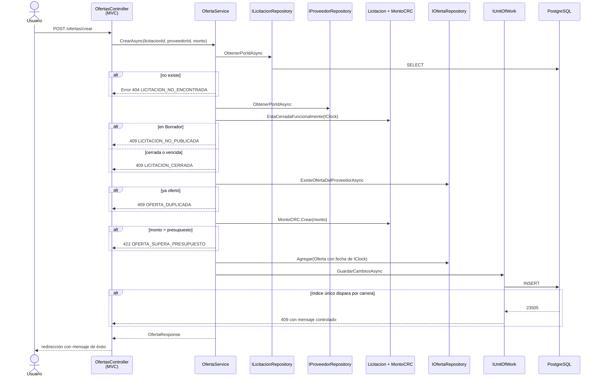
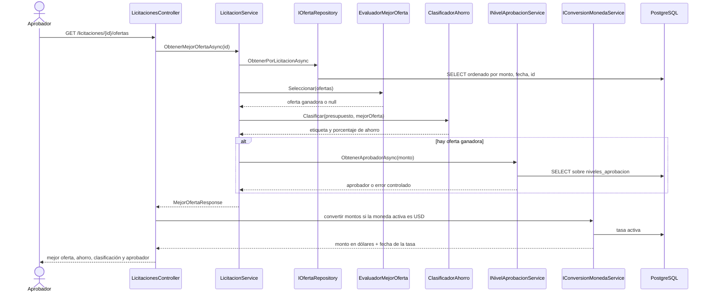
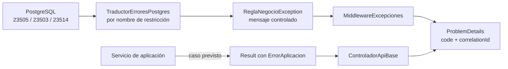

# Integración entre módulos

Volver al [índice de la documentación](README.md).

Este documento describe cómo cooperan los cinco módulos, dónde están sus fronteras y qué
recorre una petición desde que entra por la interfaz hasta que la base de datos responde.

## 1. Mapa de módulos y límites

| Módulo | Depende de | Nadie más puede |
|---|---|---|
| **Proveedores** | — | tocar la unicidad del nombre normalizado |
| **Licitaciones** | Niveles de aprobación | decidir una transición de estado o el cierre funcional |
| **Ofertas** | Licitaciones, Proveedores | decidir si una licitación admite ofertas |
| **Niveles de aprobación** | — | resolver quién aprueba un monto |
| **Tipo de cambio** | — | decidir qué tasa está vigente |

La regla de frontera es una sola: **un módulo no accede al repositorio de otro.** Cuando
Licitaciones necesita el aprobador de la mejor oferta, no consulta la tabla de niveles:
llama a `INivelAprobacionService.ObtenerAprobadorAsync`. Si mañana la política de
aprobación cambiara —escalones distintos, criterio por tipo de compra— el cambio queda
dentro de su módulo.

La excepción aparente es Ofertas, que sí consulta `ILicitacionRepository` y
`IProveedorRepository`. No es una violación: son **puertos declarados en la capa de
aplicación**, no el repositorio interno de otro módulo, y Ofertas necesita la entidad
`Licitacion` completa para preguntarle `EstaCerradaFuncionalmente`. Enrutarlo por el
servicio de licitaciones solo añadiría una vuelta sin cambiar el acoplamiento.

## 2. Dueño de cada regla de negocio

| ID | Regla | Módulo dueño | Dónde vive |
|---|---|---|---|
| R01 | Presupuesto mayor que cero | Licitaciones | `MontoCRC` + restricción de verificación |
| R02 | Monto ofertado mayor que cero | Ofertas | `MontoCRC` + restricción de verificación |
| R03 | Oferta no superior al presupuesto | Ofertas | `OfertaService.ComprobarMonto` |
| R04 | Oferta igual al presupuesto es válida | Ofertas | la comparación es `>`, no `>=` |
| R05 | Una oferta por proveedor y licitación | Ofertas | servicio + índice único compuesto |
| R06 | Solo sobre licitación publicada | Ofertas | `OfertaService.ComprobarQueAdmiteOfertas` |
| R07 | Solo antes de la fecha de cierre | Licitaciones | `Licitacion.EstaCerradaFuncionalmente` |
| R08 | Cierre funcional por fecha alcanzada | Licitaciones | `Licitacion.EstaCerradaFuncionalmente` |
| R09 | Nombre de proveedor único | Proveedores | normalizador + índice único parcial |
| R10 | Caracteres admitidos en el nombre | Proveedores | `ValidadorNombreProveedor` |
| R11 | Código de licitación único | Licitaciones | normalizador + índice único parcial |
| R12 | Mejor oferta es la de menor monto | Ofertas | `EvaluadorMejorOferta` |
| R13 | Desempate por orden de llegada | Ofertas | `EvaluadorMejorOferta` |
| R14 | Clasificación del ahorro | Ofertas | `ClasificadorAhorro` |
| R15 | Aprobador desde tabla parametrizable | Niveles de aprobación | `NivelAprobacionRepository.ObtenerAplicableAsync` |
| R16 | Rangos sin traslape | Niveles de aprobación | `NivelAprobacion.SeTraslapaCon` |
| R17 | Un solo rango abierto | Niveles de aprobación | `NivelAprobacionService.ComprobarConvivencia` |
| R18 | Conversión a dólares | Tipo de cambio | `ConversionMonedaService` |
| R19 | Un solo tipo de cambio activo | Tipo de cambio | transacción + índice único parcial |
| R20 | Transiciones de estado | Licitaciones | `MaquinaEstadosLicitacion` |
| R21 | No reducir presupuesto bajo una oferta | Licitaciones | `LicitacionService.ActualizarAsync` |
| R22 | No borrar con dependencias | Proveedores, Licitaciones | borrado lógico + clave foránea restrictiva |
| R23 | Oferta de licitación cerrada es inmutable | Ofertas | `OfertaService.CargarParaModificarAsync` |

Ninguna regla vive en un controlador ni en una vista.

## 3. Flujo de extremo a extremo: registrar una oferta

**Puntos que conviene señalar del recorrido:**

1. **El orden de las comprobaciones importa.** Una licitación en Borrador da un mensaje
   distinto al de una publicada cuyo plazo venció, y quien opera necesita distinguirlas.
2. **La fecha de registro la pone `IClock`, no el cliente.** Es la que decide el desempate
   de la mejor oferta; dejarla en manos de quien envía la petición permitiría colarse.
3. **La unicidad se comprueba dos veces.** El servicio consulta antes de insertar, y el
   índice único de PostgreSQL cierra la ventana entre esa consulta y la escritura. Si
   dispara, `TraductorErroresPostgres` devuelve el mismo mensaje que habría dado el
   servicio: quien usa el sistema no nota la diferencia.
4. **El controlador no valida nada.** Recibe el resultado y lo traduce a una vista o a un
   código HTTP.

## 4. Flujo de extremo a extremo: consultar la mejor oferta

**Puntos que conviene señalar:**

1. **Cuatro módulos cooperan sin conocerse entre sí.** Licitaciones orquesta, pero el
   aprobador lo resuelve Niveles y la conversión la resuelve Tipo de cambio.
2. **La ausencia de ofertas no es un error.** Devuelve la etiqueta "Sin ofertas válidas" y
   ningún aprobador; la vista lo muestra tal cual.
3. **Si ningún rango cubre el monto**, el aprobador queda vacío y la vista dice "Ningún
   nivel de aprobación cubre este monto". No revienta.
4. **La conversión ocurre al presentar, nunca al guardar.** Los colones siguen siendo la
   única fuente de verdad; el monto en dólares se recalcula en cada consulta y se muestra
   siempre junto a la fecha de la tasa usada.

## 5. Contratos entre módulos

Lo que un módulo expone a los demás son interfaces de la capa de aplicación:

| Contrato | Lo consume | Para qué |
|---|---|---|
| `INivelAprobacionService.ObtenerAprobadorAsync` | Licitaciones | resolver el aprobador de la mejor oferta |
| `IConversionMonedaService.ConvertirAsync` | Interfaz web, API | mostrar montos en dólares |
| `ILicitacionRepository.ObtenerPorIdAsync` | Ofertas | comprobar estado y vencimiento |
| `IProveedorRepository.ObtenerPorIdAsync` | Ofertas | comprobar que el proveedor existe |
| `IOfertaRepository.ObtenerMontoMaximoAsync` | Licitaciones | impedir bajar el presupuesto bajo una oferta |
| `IOfertaRepository.ListarDetalleAsync` | Licitaciones, Proveedores | listar ofertas con el código y el nombre ya resueltos |

`IUnitOfWork` es transversal: cualquier caso de uso que escriba pasa por él, y las
operaciones que tocan varios registros —activar un tipo de cambio, revalidar rangos de
aprobación— usan `EjecutarEnTransaccionAsync` para que no queden a medias.

## 6. Errores que cruzan fronteras

Un fallo de PostgreSQL no sube tal cual. El recorrido es:

La vía normal es la de abajo: el servicio devuelve un `Result` fallido y
`ControladorApiBase` lo traduce a 404, 409 o 422. La de arriba es la red de seguridad para
lo que se escapa. **En ninguna de las dos llega al cliente el mensaje crudo del motor**,
que revelaría nombres de tablas, de índices y detalles de la instalación.
