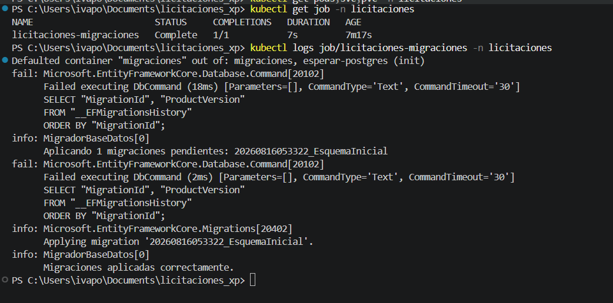
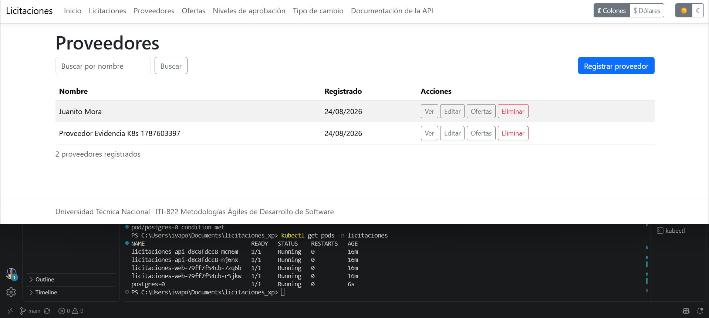
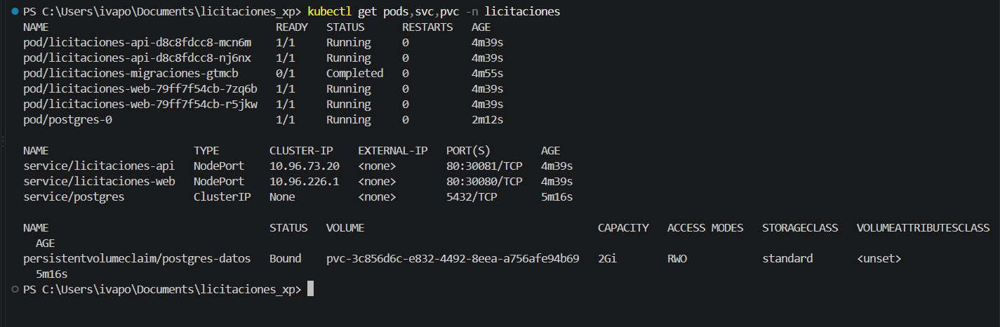
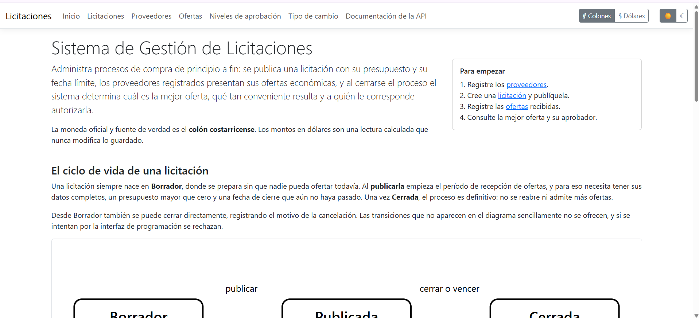

# Kubernetes

Volver al [índice de la documentación](README.md).

Los manifiestos viven en [`/k8s`](../k8s) y despliegan el sistema completo en su propio
espacio de nombres, con almacenamiento persistente para la base de datos.

## 1. Clúster utilizado

Los manifiestos no dependen de ningún proveedor: usan únicamente objetos estándar y una
clase de almacenamiento por omisión. Se han pensado para un clúster local
—**minikube**, **kind** o el Kubernetes que trae Docker Desktop— y funcionan igual en uno
gestionado cambiando el tipo de los servicios.

| Requisito | Nota |
|---|---|
| Kubernetes | 1.27 o superior |
| Clase de almacenamiento por omisión | Necesaria para el volumen de PostgreSQL |
| Imágenes disponibles en el clúster | Ver la sección siguiente |

### Las imágenes deben estar en el clúster

Los manifiestos usan `imagePullPolicy: IfNotPresent` y no apuntan a ningún registro, así
que las imágenes tienen que existir en el nodo. Se construyen y se cargan así:

```bash
docker build -t licitaciones-web:1.0.0 --build-arg PROYECTO=Licitaciones.Web .
docker build -t licitaciones-api:1.0.0 --build-arg PROYECTO=Licitaciones.Api .

# minikube
minikube image load licitaciones-web:1.0.0
minikube image load licitaciones-api:1.0.0

# kind
kind load docker-image licitaciones-web:1.0.0
kind load docker-image licitaciones-api:1.0.0
```

Con Docker Desktop no hace falta cargarlas: comparte el mismo almacén de imágenes.

## 2. Orden de aplicación de los manifiestos

El espacio de nombres va primero porque todo lo demás vive dentro de él; el resto puede
aplicarse en bloque. El único paso manual es el secreto.

```bash
kubectl apply -f k8s/namespace.yaml
kubectl apply -f k8s/app-configmap.yaml

# El secreto real se crea a mano. Ver la sección 3.
kubectl create secret generic licitaciones-secret \
  --namespace licitaciones \
  --from-literal=POSTGRES_USER='usuario_real' \
  --from-literal=POSTGRES_PASSWORD='contrasena_real'

kubectl apply -f k8s/postgres-pvc.yaml
kubectl apply -f k8s/postgres-service.yaml
kubectl apply -f k8s/postgres-statefulset.yaml
kubectl wait --namespace licitaciones --for=condition=ready pod -l app.kubernetes.io/name=postgres --timeout=180s

# Las migraciones corren una sola vez, en un Job, y no al arrancar cada réplica.
kubectl apply -f k8s/migraciones-job.yaml
kubectl wait --namespace licitaciones --for=condition=complete job/licitaciones-migraciones --timeout=180s

kubectl apply -f k8s/app-deployment.yaml
kubectl apply -f k8s/app-service.yaml
kubectl apply -f k8s/api.yaml
```

Una vez creado el espacio de nombres y el secreto, `kubectl apply -f k8s/` aplica todo lo
demás de una vez; el orden explícito de arriba solo hace falta la primera vez, para poder
esperar a que la base esté lista antes de migrar.

Al terminar:

| Servicio | Dirección |
|---|---|
| Aplicación web | http://localhost:30080 |
| API | http://localhost:30081 |
| Documentación interactiva | http://localhost:30081/swagger |

> **Si el clúster es el de Docker Desktop**, esas direcciones no responden. Su Kubernetes
> usa `kind`, que no publica los puertos de nodo en el equipo anfitrión. En ese caso se
> abre un túnel, dejando cada comando corriendo en su propia terminal:
>
> ```bash
> kubectl port-forward --namespace licitaciones service/licitaciones-web 8080:80
> kubectl port-forward --namespace licitaciones service/licitaciones-api 8081:80
> ```
>
> Y se accede entonces por `http://localhost:8080` y `http://localhost:8081`. En Minikube
> los puertos de nodo sí funcionan y el túnel no hace falta.

En minikube, `minikube service licitaciones-web --namespace licitaciones` abre la dirección
que corresponda.

Para desmontarlo todo basta con borrar el espacio de nombres, que se lleva consigo lo que
contiene:

```bash
kubectl delete namespace licitaciones
```

## 3. Creación del secreto real a partir del ejemplo

El repositorio versiona **solo** [`k8s/app-secret.example.yaml`](../k8s/app-secret.example.yaml),
con valores ficticios. Ese archivo no se aplica: existe para que quien despliegue sepa qué
claves espera el resto de los manifiestos sin tener que leerlos uno por uno.

El secreto real se crea con `kubectl create secret`, como se muestra arriba, y nunca entra
al repositorio. La configuración que no es sensible —nombre de la base, anfitrión, puerto,
entorno— vive aparte, en el mapa de configuración.

Ambos se consumen igual desde los contenedores, con `envFrom`, y la cadena de conexión se
arma juntando las dos fuentes:

```yaml
- name: ConnectionStrings__Default
  value: "Host=$(POSTGRES_HOST);Port=$(POSTGRES_PORT);Database=$(POSTGRES_DB);Username=$(POSTGRES_USER);Password=$(POSTGRES_PASSWORD)"
```

## 4. Ejecución controlada de las migraciones

Las migraciones **no se aplican al arrancar la aplicación**. Con dos réplicas, ambas
intentarían migrar a la vez sobre la misma base.

En su lugar hay un `Job` que corre una sola vez:

- Un contenedor de inicialización espera con `pg_isready` a que PostgreSQL acepte
  conexiones.
- El contenedor principal usa **la misma imagen de la API**, invocada con
  `--aplicar-migraciones`. Aplica lo pendiente, informa de qué hizo y termina.
- Si algo falla, sale con código distinto de cero y el Job se marca como fallido en lugar
  de dejar la aplicación arrancar sobre un esquema incompleto.

Su registro dice exactamente qué se aplicó:

```bash
kubectl logs --namespace licitaciones job/licitaciones-migraciones
```



El Job se conserva diez minutos tras terminar —`ttlSecondsAfterFinished`— para poder leer
ese registro, y luego se limpia solo.

> Los dos mensajes de error que aparecen en el registro **no son un fallo**. Ambos son la
> misma consulta a `__EFMigrationsHistory`, la tabla donde Entity Framework Core lleva la
> cuenta de lo aplicado. En una base recién creada esa tabla todavía no existe, así que la
> consulta falla; Entity Framework Core lo interpreta como «ninguna migración aplicada» y
> continúa, pero su registrador anota igualmente toda orden SQL fallida. La prueba de que
> todo fue bien es que el Job termina en `Complete` y el mensaje final dice que las
> migraciones se aplicaron correctamente. La segunda vez que se ejecuta, con el historial
> ya creado, el registro sale limpio.

## 5. Sondas y límites

Los dos despliegues declaran las **tres sondas** y sus límites de recursos.

| Sonda | Ruta | Qué responde | Qué pasa si falla |
|---|---|---|---|
| Arranque | `/health/live` | Que el proceso levantó | Da margen de dos minutos antes de que las otras actúen |
| Disponibilidad | `/health/ready` | Que además alcanza la base | El pod sale del servicio, pero no se reinicia |
| Vitalidad | `/health/live` | Que el proceso responde | El contenedor se reinicia |

La distinción importa. **La sonda de vitalidad no consulta la base a propósito**: si lo
hiciera, una base lenta o momentáneamente caída provocaría reinicios en cadena de una
aplicación que está perfectamente sana, y reiniciarla no arreglaría nada. Quien decide si
un pod recibe tráfico es la sonda de disponibilidad; quien decide si hay que reiniciarlo es
la de vitalidad.

| Recurso | Solicitado | Límite |
|---|---|---|
| Web y API, procesador | 100m | 500m |
| Web y API, memoria | 192Mi | 512Mi |
| PostgreSQL, procesador | 100m | 1 |
| PostgreSQL, memoria | 256Mi | 1Gi |

Los contenedores de la aplicación corren **sin privilegios**, con el sistema de archivos
raíz de solo lectura y sin ninguna capacidad del núcleo. Como .NET necesita escribir
temporales, se les monta un `emptyDir` en `/tmp`.

## 6. Conservación de datos tras reinicio

PostgreSQL se despliega como `StatefulSet` y no como `Deployment` porque una base de datos
tiene identidad: su volumen debe seguir siendo el mismo cuando el pod se recrea. El
reclamo de `postgres-pvc.yaml` le da un disco propio que sobrevive al pod.

La comprobación es directa: se crea un dato, se borra el pod y se comprueba que sigue ahí.

```bash
# 1. Crear un proveedor
curl -s -X POST http://localhost:30081/api/v1/proveedores \
  -H "Content-Type: application/json" \
  -d '{"nombre":"Persistencia Kubernetes S.A."}'

# 2. Borrar el pod de la base. El StatefulSet lo recrea solo.
kubectl delete pod --namespace licitaciones postgres-0
kubectl wait --namespace licitaciones --for=condition=ready pod/postgres-0 --timeout=180s

# 3. El dato sigue ahí
curl -s "http://localhost:30081/api/v1/proveedores?busqueda=Persistencia"
```

El identificador devuelto en el paso 3 es el mismo del paso 1: no es un registro nuevo.

En la captura se ve el resultado: el listado conserva los dos proveedores y, abajo, la
antigüedad de los pods delata lo ocurrido. `postgres-0` lleva seis segundos —acaba de
recrearse— mientras que los de la web y la API llevan dieciséis minutos. El pod es nuevo;
los datos, no.



Mientras el pod se recrea, las réplicas de la web y de la API siguen vivas pero salen del
servicio, porque su sonda de disponibilidad falla. Vuelven solas en cuanto la base
responde, sin que nadie tenga que reiniciarlas.

## 7. Evidencias de despliegue

Comandos para dejar constancia del estado del despliegue:

```bash
kubectl get all --namespace licitaciones
kubectl get pvc --namespace licitaciones
kubectl describe pod --namespace licitaciones -l app.kubernetes.io/name=web
kubectl logs --namespace licitaciones job/licitaciones-migraciones
```

### Estado del despliegue

Pods, servicios y reclamo de almacenamiento tras aplicar todos los manifiestos. El Job
figura como `Completed`, que es su estado correcto, y el reclamo aparece como `Bound`.



### La aplicación respondiendo desde el clúster



> **Dónde se ejecutó.** El despliegue de las capturas se hizo sobre el Kubernetes que
> incorpora Docker Desktop, que internamente usa `kind`. Los manifiestos se validaron
> además con `kubeconform` —once recursos, ninguno inválido—, y esa validación forma parte
> del flujo de integración continua, de modo que un manifiesto mal formado se detecta antes
> de llegar a un clúster.
