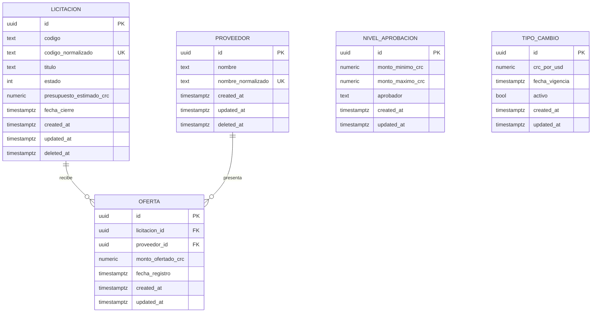

# Modelo de datos y persistencia

Volver al [índice de la documentación](README.md).

Motor: **PostgreSQL 16**. Acceso mediante Entity Framework Core 9 con el proveedor
Npgsql. El esquema se crea aplicando migraciones versionadas; nunca con `EnsureCreated`.

## 1. Diagrama entidad-relación



`NIVEL_APROBACION` y `TIPO_CAMBIO` no tienen relación con las demás entidades: son tablas
de parametrización que se consultan por valor, no por clave foránea.

## 2. Entidades y campos

### licitaciones

| Columna | Tipo | Notas |
|---|---|---|
| `id` | `uuid` | Clave primaria, generada por el sistema. No editable. |
| `codigo` | `varchar(50)` | Tal como lo escribió la persona usuaria. |
| `codigo_normalizado` | `varchar(50)` | Recortado y en mayúsculas. Respalda el índice único. |
| `titulo` | `varchar(200)` | Requerido. |
| `estado` | `integer` | 1 Borrador, 2 Publicada, 3 Cerrada. |
| `presupuesto_estimado_crc` | `numeric(18,2)` | Mayor que cero. |
| `fecha_cierre` | `timestamptz` | Almacenada en UTC. |
| `created_at`, `updated_at` | `timestamptz` | Auditoría automática. |
| `deleted_at` | `timestamptz` nulo | Borrado lógico. |
| `xmin` | `xid` | Columna de sistema usada como testigo de concurrencia. |

### proveedores

| Columna | Tipo | Notas |
|---|---|---|
| `id` | `uuid` | Clave primaria. |
| `nombre` | `varchar(200)` | Tal como lo escribió la persona usuaria. |
| `nombre_normalizado` | `varchar(200)` | Unicode unificado, espacios colapsados, minúsculas. |
| `created_at`, `updated_at` | `timestamptz` | Auditoría automática. |
| `deleted_at` | `timestamptz` nulo | Borrado lógico. |

### ofertas

| Columna | Tipo | Notas |
|---|---|---|
| `id` | `uuid` | Clave primaria. |
| `licitacion_id` | `uuid` | Clave foránea restrictiva. |
| `proveedor_id` | `uuid` | Clave foránea restrictiva. |
| `monto_ofertado_crc` | `numeric(18,2)` | Mayor que cero. |
| `fecha_registro` | `timestamptz` | Define el orden de llegada. |
| `created_at`, `updated_at` | `timestamptz` | Auditoría automática. |

La oferta **no** tiene `deleted_at`: o existe, o se elimina físicamente mientras la
licitación siga vigente. Una vez cerrada la licitación queda inmutable.

### niveles_aprobacion

| Columna | Tipo | Notas |
|---|---|---|
| `id` | `uuid` | Clave primaria. |
| `monto_minimo_crc` | `numeric(18,2)` | Inclusivo, mayor que cero. |
| `monto_maximo_crc` | `numeric(18,2)` nulo | Inclusivo. Nulo significa rango abierto. |
| `aprobador` | `varchar(100)` | Requerido. |

### tipos_cambio

| Columna | Tipo | Notas |
|---|---|---|
| `id` | `uuid` | Clave primaria. |
| `crc_por_usd` | `numeric(18,4)` | Mayor que cero. |
| `fecha_vigencia` | `timestamptz` | Se muestra junto al monto convertido. |
| `activo` | `boolean` | Solo un registro activo a la vez. |

## 3. Decisiones de tipo

**Los montos son `numeric(18,2)` y en el código `decimal`.** Nunca `float` ni `double`:
la coma flotante binaria no puede representar exactamente 0,01, y las reglas de negocio
comparan igualdades —oferta igual al presupuesto, ahorro de exactamente 10 %— donde un
error de redondeo cambiaría el resultado.

**La tasa de cambio admite cuatro decimales** porque es un factor de conversión, no una
cantidad de dinero que deba cuadrar al céntimo.

**Las fechas son `timestamptz` y se comparan en UTC.** Npgsql rechaza escribir un
`DateTimeOffset` con desplazamiento distinto de cero en esa columna, así que la conversión
a tiempo universal se aplica mediante una convención del modelo, no columna por columna:
ninguna fecha puede llegar a la base sin normalizar. La presentación en
`America/Costa_Rica` ocurre en la capa de interfaz.

**Los identificadores son `uuid` generados por el sistema.** No aparecen en los
formularios de creación ni pueden modificarse por la API.

## 4. Índices y restricciones

### Índices únicos

| Índice | Columnas | Filtro | Regla que implementa |
|---|---|---|---|
| `ix_licitaciones_codigo_normalizado` | `codigo_normalizado` | `deleted_at IS NULL` | R11 · Código único |
| `ix_proveedores_nombre_normalizado` | `nombre_normalizado` | `deleted_at IS NULL` | R09 · Nombre único |
| `ix_ofertas_licitacion_proveedor` | `licitacion_id`, `proveedor_id` | — | R05 · Una oferta por proveedor |
| `ix_tipos_cambio_unico_activo` | `activo` | `activo = true` | R19 · Un solo tipo de cambio activo |

Los tres primeros son **parciales** en las entidades con borrado lógico: dos licitaciones
pueden compartir código si una ya fue dada de baja, porque ese código dejó de identificar
un proceso vigente. Sin el filtro, dar de baja y volver a crear sería imposible.

El índice sobre `activo` es el mecanismo que hace imposible tener dos tasas vigentes
aunque dos peticiones simultáneas burlen la comprobación del servidor.

### Restricciones de verificación

| Restricción | Condición |
|---|---|
| `ck_licitaciones_presupuesto_positivo` | `presupuesto_estimado_crc > 0` |
| `ck_ofertas_monto_positivo` | `monto_ofertado_crc > 0` |
| `ck_tipos_cambio_tasa_positiva` | `crc_por_usd > 0` |
| `ck_niveles_rango_valido` | `monto_minimo_crc > 0 AND (monto_maximo_crc IS NULL OR monto_maximo_crc >= monto_minimo_crc)` |

Duplican deliberadamente lo que ya valida el dominio. Es la tercera capa de la validación
triple: si alguien escribe por SQL directo, la base sigue rechazando el dato. La prueba
`UnMontoNoPositivoEsRechazadoPorLaBaseAunqueSeBurleElDominio` lo comprueba insertando por
fuera de Entity Framework Core.

### Claves foráneas

`ofertas.licitacion_id` y `ofertas.proveedor_id` usan **borrado restrictivo**. Combinado
con el borrado lógico, esto hace imposible que una licitación o un proveedor con ofertas
desaparezcan y dejen la evidencia huérfana.

### Índices de apoyo

| Índice | Columnas | Para qué |
|---|---|---|
| `ix_ofertas_mejor_oferta` | `licitacion_id`, `monto_ofertado_crc`, `fecha_registro` | Consulta de la mejor oferta |
| `ix_licitaciones_estado_fecha_cierre` | `estado`, `fecha_cierre` | Listados y filtros |
| `ix_niveles_aprobacion_monto_minimo` | `monto_minimo_crc` | Búsqueda del aprobador |

## 5. Auditoría y borrado lógico

Un interceptor que corre antes de guardar asigna `created_at` al insertar y `updated_at`
al insertar y al modificar, tomando la hora de `IClock`. Escribe a través del seguimiento
de cambios y no de las propiedades de la entidad, porque el dominio las expone solo para
lectura: cuándo y quién las asigna es una decisión de infraestructura.

Ese mismo interceptor convierte cada eliminación de una entidad con borrado lógico en una
modificación que fija `deleted_at`. Un filtro global de consulta excluye las filas dadas
de baja de todas las consultas ordinarias; `IgnoreQueryFilters` permite verlas cuando hace
falta auditar.

## 6. Concurrencia optimista

Se usa la columna de sistema **`xmin`**, donde PostgreSQL guarda el identificador de la
transacción que escribió cada fila por última vez. Cambia sola en cada actualización, así
que no hay que añadir ni mantener una columna de versión propia. Se declara como propiedad
sombra para que el dominio no tenga que conocerla.

Cuando dos personas editan el mismo registro, la segunda en guardar recibe
`DbUpdateConcurrencyException`, que la capa superior traduce a un mensaje comprensible y,
en la API, al código 409.

> **Nota de implementación:** el método `UseXminAsConcurrencyToken` fue retirado del
> proveedor Npgsql 9. La configuración equivalente se escribe a mano en
> `ConcurrenciaExtensions`. El generador de SQL reconoce `xmin` como columna de sistema y
> no intenta crearla, aunque la migración la declare.

## 7. Transacciones

`IUnitOfWork.EjecutarEnTransaccionAsync` envuelve las operaciones que afectan a varios
registros relacionados: activar un tipo de cambio, revalidar rangos de aprobación. Si la
operación falla, no queda ningún cambio aplicado. Si ya hay una transacción en curso, la
operación se suma a ella en lugar de abrir una anidada, que PostgreSQL no admite.

## 8. Migraciones

Las migraciones están versionadas en `src/Licitaciones.Infrastructure/Persistencia/Migraciones`.

```bash
# Crear una migración nueva
dotnet ef migrations add <Nombre> --project src/Licitaciones.Infrastructure --output-dir Persistencia/Migraciones

# Ver el SQL sin aplicarlo
dotnet ef migrations script --project src/Licitaciones.Infrastructure --idempotent
```

> Las migraciones se generan con finales de línea CRLF. Después de crear una, hay que
> ejecutar `dotnet format` o la verificación de formato de la integración continua falla.

En Kubernetes las migraciones se aplican de forma controlada mediante un `Job` o un
contenedor de inicio, **nunca al arrancar cada réplica**.

## 9. Datos semilla

**Niveles de aprobación**

| Monto mínimo CRC | Monto máximo CRC | Aprobador |
|---|---|---|
| 0,01 | 999 999,99 | Encargado de área |
| 1 000 000,00 | 9 999 999,99 | Gerencia |
| 10 000 000,00 | *(sin límite)* | Junta Directiva |

**Tipo de cambio inicial:** 512,0000 CRC por USD, activo, con vigencia desde el 1 de enero
de 2026. Su presencia es lo que permite que la conversión funcione sin acceso a Internet
desde la primera ejecución.

Los identificadores y las fechas de la semilla son constantes literales, no valores
calculados: si se usara `Guid.NewGuid()` o la hora actual, cada ejecución generaría una
migración distinta.

## 10. Configuración y secretos

La cadena de conexión se toma **únicamente** de la variable de entorno
`ConnectionStrings__Default`. No hay credenciales en `appsettings.json` ni en ningún
archivo versionado.
