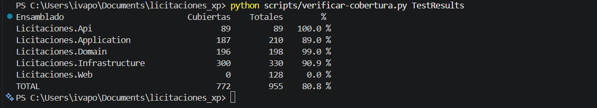
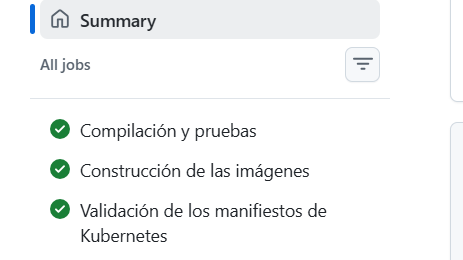
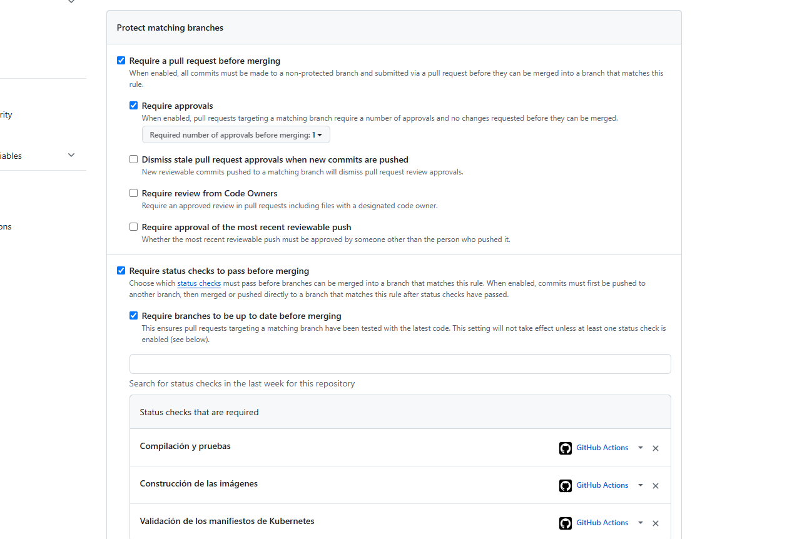

# Pruebas y desarrollo dirigido por pruebas

Volver al [índice de la documentación](README.md).

## 1. Estrategia general

Tres niveles, cada uno con una pregunta distinta y un costo distinto.

| Proyecto | Qué verifica | Contra qué corre | Cuántas |
|---|---|---|---|
| `Licitaciones.UnitTests` | Reglas de dominio y de aplicación | Nada externo. Dobles en memoria | 244 |
| `Licitaciones.IntegrationTests` | Persistencia y contrato de la API | PostgreSQL 16 real en contenedor | 103 |
| `Licitaciones.FunctionalTests` | Lo que ve y hace la persona usuaria | La aplicación publicada, en un navegador real | 7 |

La regla de reparto es sencilla: **cada cosa se prueba en el nivel más barato donde se
pueda probar de verdad.** Una regla de negocio se verifica en una prueba unitaria, que
tarda milisegundos. Un índice único parcial no existe fuera de PostgreSQL, así que se
verifica contra PostgreSQL. Que el tema no parpadee solo se puede comprobar en un
navegador.

Ninguna prueba de integración usa base en memoria. Las bases en memoria no tienen índices
parciales, ni restricciones de verificación, ni tipos numéricos exactos, ni concurrencia
por `xmin`: probar contra ellas daría verde sobre cosas que en producción fallarían.

## 2. Cómo se aplicó TDD

El ciclo **prueba que falla → implementación mínima → refactorización** queda en el
historial, en commits separados. Algunos ejemplos reales:

| Historia | Prueba que falla | Implementación | Refactorización |
|---|---|---|---|
| HU-002 · Ciclo de estados | `7cce7cd` | `865617f` | `097a14c` |
| HU-004 · Código único | `220ad5c` | `c56c0e8` | `3063fa8` |
| HU-009 · Clasificación del ahorro | `131cb81` | `1fe9435` | — |
| HU-018 a HU-022 · Ofertas | `f9c9efe` | `bd80333` | `30b13d7` |
| HU-024, HU-025 · Aprobación | `fe9d765` | `e5c4ad8` | — |
| HU-026 · Tipo de cambio | `c8bcadb` | `baeae97` | — |
| HU-027 · Montos en dólares | `ac3d6ac` | `551b1ae` | — |
| HU-030 · Listados | `b84e44f` | `3ca26ab` | — |

La lista completa, junto con las salvedades de las historias donde el ciclo **no** se
siguió, está en [bitacora-xp.md](bitacora-xp.md#evidencia-del-ciclo-de-pruebas). Se
registran las excepciones porque el historial debe reflejar lo que ocurrió y no lo que
convendría que hubiera ocurrido.

### Las pruebas encontraron defectos reales

No son un trámite. Estos fallos los detectó una prueba antes de que el código saliera de su
rama, y están detallados en la bitácora:

- **HU-009.** La etiqueta del ahorro comparaba el porcentaje **redondeado** contra cero,
  de modo que una oferta de 999 999,99 sobre un presupuesto de 1 000 000,00 se etiquetaba
  como "sin ahorro".
- **Entrega 7.** La consulta de detalle de ofertas filtraba sobre el tipo ya proyectado y
  Entity Framework Core no podía traducirla a SQL. Los endpoints devolvían 500.
- **Entrega 9.** La fecha de vigencia se mostraba un día antes por convertirla a hora
  local. La corrección fue en el dominio, no en la vista.
- **Entrega 10.** La búsqueda de ofertas se aplicaba **después** de paginar, lo que
  producía páginas incompletas y un total que ignoraba el filtro.
- **Entrega 13.** Los formularios no podían guardar ningún decimal. Se detalla abajo.

### El defecto que solo podía encontrar un navegador

Al escribir el recorrido de HU-035, el formulario de licitaciones rechazaba un presupuesto
perfectamente válido. La causa: la aplicación se presenta con la cultura de Costa Rica,
donde el punto separa los miles y la coma los decimales, pero un campo
`input type="number"` **siempre** envía el valor en formato invariante. Así,
`10000000.00` llegaba al servidor y `es-CR` no lo podía interpretar, porque su último
grupo tiene dos dígitos en lugar de tres. El monto se enlazaba como cero y el formulario
rechazaba el dato.

El defecto llevaba ahí desde la entrega 5 y **ninguna prueba anterior podía verlo**: las de
la API envían JSON, que se interpreta siempre en formato invariante. Solo un navegador
enviando un formulario real lo saca a la luz. Se corrigió con
`EnlazadorDecimalInvariante`, que prueba primero la cultura invariante y después la del
sitio.

## 3. Comandos de ejecución

```bash
dotnet test                                    # todo
dotnet test tests/Licitaciones.UnitTests       # sin Docker, en segundos
dotnet test tests/Licitaciones.IntegrationTests
dotnet test tests/Licitaciones.FunctionalTests
```

Las pruebas funcionales necesitan el navegador de Playwright, que se instala una sola vez:

```bash
pwsh tests/Licitaciones.FunctionalTests/bin/Release/net9.0/playwright.ps1 install chromium
```

### Requisitos por nivel

| Nivel | Necesita |
|---|---|
| Unitarias | Nada. Corren en cualquier máquina con el SDK |
| Integración | Docker en marcha |
| Funcionales | Docker, el SDK y el navegador de Playwright |

## 4. Casos principales por capa

### Dominio

| Prueba | Qué fija |
|---|---|
| `MaquinaEstadosLicitacionTests` | Las cinco transiciones y las que no existen |
| `CierreFuncionalLicitacionTests` | Que el instante exacto de cierre ya cuenta como cerrado |
| `NormalizadorCodigoTests`, `NormalizadorNombreProveedorTests` | Que dos formas de escribir lo mismo son lo mismo |
| `ValidadorNombreProveedorTests` | Los caracteres admitidos, uno por uno |
| `MontoCRCTests` | Cero, negativos y más de dos decimales |
| `EvaluadorMejorOfertaTests` | El desempate determinista |
| `ClasificadorAhorroTests` | Los cuatro tramos, con sus fronteras exactas |
| `TipoCambioTests` | Tasa positiva y la vigencia como fecha de calendario |
| `DireccionDependenciasTests` | Que el dominio no conoce a la infraestructura |

### Aplicación

`ProveedorServiceTests`, `LicitacionServiceTests`, `OfertaServiceTests`,
`NivelAprobacionServiceTests`, `TipoCambioServiceTests` y `ConversionMonedaServiceTests`
cubren cada regla con sus casos frontera y la traducción de los errores del dominio a
códigos del contrato.

### Persistencia

`PersistenciaTests`, `RestriccionesTests`, `AuditoriaYBorradoLogicoTests`,
`ConcurrenciaYTransaccionesTests` y `RepositoriosTests`, todas contra PostgreSQL real.

### API

`ContratoApiTests` verifica lo transversal: versionado, forma y acotación de los listados,
códigos de estado y cuerpos de error. `NingunErrorRevelaDetallesInternos` comprueba
explícitamente que ninguna respuesta contenga trazas, consultas ni credenciales. Los cinco
módulos tienen además su archivo de endpoints.

### Navegador

| Prueba | Qué recorre |
|---|---|
| `RecorridoCompletoTests` | Página inicial, cambio de tema, alta de proveedor, creación y publicación de licitación, oferta válida, los tres rechazos, mejor oferta con su clasificación y su aprobador, y alternancia entre colones y dólares |
| `CicloDeVidaDeCadaModuloTests` | Creación, consulta, edición y eliminación en los cinco módulos, la activación exclusiva del tipo de cambio, el traslape de rangos y que el mensaje de validación acompaña a su campo |

## 5. Cobertura

Medida con `coverlet` sobre las tres suites juntas, con la configuración de
[`.runsettings`](../.runsettings):

```bash
dotnet test --collect:"XPlat Code Coverage" --settings .runsettings --results-directory TestResults
reportgenerator -reports:"TestResults/**/coverage.cobertura.xml" -targetdir:coverage -reporttypes:TextSummary
```

| Ensamblado | Cobertura de líneas | Umbral comprometido |
|---|---|---|
| `Licitaciones.Domain` | **98,6 %** | 80 % ✅ |
| `Licitaciones.Application` | **88,2 %** | 80 % ✅ |
| `Licitaciones.Infrastructure` | 91,4 % | — |
| `Licitaciones.Api` | 100 % | — |
| `Licitaciones.Web` | 0 % medido *(ver abajo)* | — |
| **Proyecto completo** | **81,2 %** | 70 % ✅ |

Se excluyen de la medición las migraciones y el modelo instantáneo, que los genera Entity
Framework Core, y los puntos de entrada. Contarlos inflaría el porcentaje sin decir nada
sobre si las reglas de negocio están verificadas.

### Por qué `Licitaciones.Web` aparece en cero

No es que no se pruebe: sus controladores y sus vistas son justamente lo que recorren las
siete pruebas de navegador. Lo que ocurre es que **la aplicación web se ejecuta como un
proceso aparte**, porque un navegador necesita un servidor que escuche en un puerto de
verdad, y `coverlet` instrumenta el proceso donde corren las pruebas, no sus procesos
hijos. Las líneas que ese otro proceso ejecuta no se le atribuyen a nadie.

Se deja el dato tal cual en lugar de maquillarlo excluyendo el ensamblado, que subiría el
total sin cambiar nada de lo que está realmente verificado. Los umbrales comprometidos se
cumplen igual, y con el margen que muestra la tabla.

### La cobertura es una puerta, no un dato

Los umbrales no se comprueban a ojo. El flujo de integración continua ejecuta
[`scripts/verificar-cobertura.py`](../scripts/verificar-cobertura.py) después de las
pruebas, y **falla el flujo** si `Domain` o `Application` bajan del 80 % o si el total baja
del 70 %. Un cambio que reduzca la cobertura por debajo de lo acordado no se integra.

El script une los informes de las tres ejecuciones antes de medir: una misma línea puede
estar cubierta por una prueba unitaria en un informe y no aparecer en otro, y contar cada
informe por separado daría un porcentaje más bajo que el real.

Puede ejecutarse igual en local:

```bash
dotnet test --settings .runsettings --collect:"XPlat Code Coverage" --results-directory TestResults
python scripts/verificar-cobertura.py TestResults
```



El flujo completo, con los tres trabajos en verde —compilación y pruebas, construcción de
las imágenes y validación de los manifiestos—:



### El flujo bloquea la integración cuando falla

La rama `main` está protegida. No admite envíos directos: todo cambio entra por una
solicitud de integración que necesita una aprobación de la otra integrante y que los tres
trabajos del flujo terminen en verde. Un cambio que rompa la compilación, el formato, las
pruebas, los umbrales de cobertura o los manifiestos no se puede integrar.



## 6. Limitaciones conocidas

- **Las pruebas de integración y las funcionales dependen de Docker.** En una máquina sin
  Docker, `dotnet test tests/Licitaciones.UnitTests` sigue funcionando y cubre todas las
  reglas de negocio.
- **Las funcionales comparten una base entre sí.** Corren en serie, no en paralelo, y las
  que alteran la semilla —la que activa un tipo de cambio, la que le pone techo al rango
  abierto— la devuelven a su estado al terminar. Es frágil por naturaleza y por eso está
  escrito de forma explícita en cada una.
- **Solo se prueba Chromium.** El sistema no usa nada específico de un motor, pero la
  afirmación "funciona en cualquier navegador" no está verificada.
- **La cobertura de ramas es del 51 %.** Muchas de las ramas sin cubrir son comprobaciones
  de argumentos nulos y rutas de cancelación, que no corresponden a reglas del cliente. El
  compromiso adquirido fue sobre cobertura de líneas.
- **HU-028 y HU-029 no tienen prueba unitaria propia.** Son historias de presentación y se
  verifican en el navegador, dentro de `RecorridoCompletoTests`.
